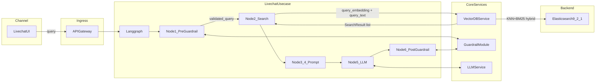
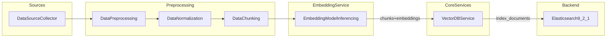

# VectorDB Service

Python library for **hybrid search** (semantic + BM25) and vector storage using **Elasticsearch 9.2.1**. Designed to be used as a **Python Module** by Langgraph Node 2 in the Livechat suggestion flow and by the Knowledge Ingestion flow for indexing documents.

## Architecture

This service is part of the Core Services layer and integrates with:

- **Livechat Usecase Service** (Langgraph Node 2): Performs **hybrid search** (semantic + BM25) to find similar queries and retrieve answers
- **Knowledge Ingestion Flow** (Node 6): Indexes processed documents with embeddings into Elasticsearch
- **Elasticsearch 9.2.1**: Backend vector store using `dense_vector` fields and:
  - **Semantic search**: cosine-similarity KNN over embeddings
  - **BM25 keyword search**: text search over `text` / `metadata`
  - **Hybrid search**: KNN + BM25 combined via Reciprocal Rank Fusion (RRF)
- **OpenTelemetry**: Observability and tracing integration

See architecture diagrams:
- `Architecture Diagram/Livechat_suggestion_flow_hld 1.png` - Livechat flow integration
- `Architecture Diagram/HLD_core 3.png` - Overall system architecture

### Data Flow Diagrams (DFD)

#### Livechat runtime flow (semantic + hybrid search)



#### Knowledge ingestion flow (indexing & storing)



## Installation

```bash
pip install -r requirements.txt
```

## Configuration

This project is a **Python module only** (no Docker image). All configuration (URLs, timeouts, etc.) is via **environment variables**. Copy `.env.example` to `.env`, set values, and load it before running (e.g. `source .env` or your app’s env loader).

| Environment Variable | Default | Description |
|---------------------|---------|-------------|
| `ELASTICSEARCH_URL` | `http://localhost:9200` | Elasticsearch cluster URL |
| `ELASTICSEARCH_INDEX_PREFIX` | `vectordb` | Prefix for index names |
| `VECTOR_DIMENSION` | `384` | Dimension of vector embeddings |
| `ELASTICSEARCH_TIMEOUT` | `30` | Request timeout in seconds |
| `ELASTICSEARCH_MAX_RETRIES` | `3` | Maximum retry attempts |
| `ENABLE_TELEMETRY` | `true` | Enable OpenTelemetry instrumentation |
| `OTLP_ENDPOINT` | (none) | OTLP endpoint for telemetry export |

### Optional: run Elasticsearch in Docker

To run only Elasticsearch in Docker, see **[DOCKER.md](DOCKER.md)**. The module runs on your host; set `ELASTICSEARCH_URL` in `.env` or your environment.

### Deployed (hosted Elasticsearch)

When deployed, set `ELASTICSEARCH_URL` to your **hosted** Elasticsearch (e.g. AWS OpenSearch, Elastic Cloud). Index your data into that host once (same as locally), then the app uses it via env. See **[DEPLOYMENT.md](DEPLOYMENT.md)**.

## Usage

### Quick: RAG flow (query → VectorDB → LLM)

Use the module in your RAG pipeline like this:

```python
# Step 1: Query processing (your embedding service)
query_text = "how to reset password"
query_embedding = embedding_service.encode(query_text)  # → vector

# Step 2: Our VectorDB module (query_text → BM25, query_embedding → KNN, hybrid → top k)
from vector_db import VectorDBClient
client = VectorDBClient()

results = client.search_hybrid(
    query_embedding=query_embedding,
    query_text=query_text,
    index="rag_chunks",
    top_k=3,
)

# Optional: custom weights (normalized KNN + BM25)
# results = client.search_hybrid(..., knn_weight=0.6, bm25_weight=0.4)

# Step 3: Top k + query → LLM (your RAG code)
context = "\n".join([r.text for r in results])
prompt = f"Context:\n{context}\n\nQuestion: {query_text}"
output = llm.generate(prompt)  # → final answer
```

### 1. Semantic Search (Langgraph Node 2)

```python
from vector_db import VectorDBClient, SearchResult

# Initialize client
client = VectorDBClient()

# Perform semantic search
query_embedding = [0.1, 0.2, 0.3, ...]  # Your query embedding from Embedding Model Inferencing service
results: List[SearchResult] = client.search(
    query_embedding=query_embedding,
    index="livechat_answers",
    top_k=5
)

# Process results
for result in results:
    print(f"ID: {result.id}")
    print(f"Score: {result.score}")
    print(f"Text: {result.text}")
    print(f"Metadata: {result.metadata}")
    print("---")
```

### 2. Search strategies (KNN, BM25, Hybrid)

The client supports three search strategies via a **Strategy Pattern**:

| Strategy | Method | Input | Description |
|----------|--------|--------|-------------|
| **KNN** | `search()` | `query_embedding` | Vector similarity (cosine) over embeddings; returns similarity scores. |
| **BM25** | `search_bm25()` | `query_text` | Keyword search over `text` / `metadata`; returns BM25 scores. |
| **Hybrid** | `search_hybrid()` | `query_embedding` + `query_text` | Combines KNN and BM25 (see below). |

#### Hybrid search (default: RRF)

By default, hybrid search uses Elasticsearch’s **Reciprocal Rank Fusion (RRF)** to combine KNN and BM25:

```python
from vector_db import VectorDBClient, SearchResult

client = VectorDBClient()

query_embedding = [0.1, 0.2, 0.3, ...]  # From Embedding Model Inferencing service
query_text = "how to reset password"    # Raw user query text

results: List[SearchResult] = client.search_hybrid(
    query_embedding=query_embedding,
    query_text=query_text,
    index="livechat_answers",
    top_k=10,
    filters={"metadata.status": "active"}  # Optional metadata filters
)

for result in results:
    print(f"ID: {result.id}")
    print(f"Score: {result.score}")
    print(f"Text: {result.text}")
    print(f"Metadata: {result.metadata}")
    print("---")
```

#### Weighted hybrid (configurable weights)

You can combine KNN and BM25 with **configurable weights** and **score normalization**:

`final_score = knn_weight * normalized_knn_score + bm25_weight * normalized_bm25_score`

Weights must be in `[0, 1]` and sum to `1.0`. Use either function arguments or `HybridSearchConfig`:

```python
from vector_db import VectorDBClient
from vector_db.config import HybridSearchConfig

client = VectorDBClient()

# Via function arguments
results = client.search_hybrid(
    query_embedding=query_embedding,
    query_text=query_text,
    index="livechat_answers",
    top_k=10,
    knn_weight=0.6,
    bm25_weight=0.4,
)

# Or via config (e.g. from env or app config)
config = HybridSearchConfig(knn_weight=0.7, bm25_weight=0.3)
results = client.search_hybrid(
    query_embedding=query_embedding,
    query_text=query_text,
    index="livechat_answers",
    top_k=10,
    hybrid_config=config,
)
```

#### BM25-only search

For keyword-only ranking without embeddings:

```python
results = client.search_bm25(
    query_text="reset password",
    index="livechat_answers",
    top_k=10,
    filters={"metadata.category": "faq"},
)
```

### 3. Semantic Search with Filters

```python
results = client.search(
    query_embedding=query_embedding,
    index="livechat_answers",
    top_k=10,
    filters={"metadata.status": "active", "metadata.category": "faq"}
)
```

### 4. Index Documents (Knowledge Ingestion Flow)

```python
from vector_db import VectorDBClient, Document

client = VectorDBClient()

# Prepare documents (embeddings should already be computed by Embedding Model Inferencing service)
documents = [
    Document(
        id="doc_001",
        embedding=[0.1, 0.2, 0.3, ...],  # Pre-computed embedding
        text="Answer text or document content",
        metadata={"source": "kb", "category": "faq", "status": "active"}
    ),
    Document(
        id="doc_002",
        embedding=[0.4, 0.5, 0.6, ...],
        text="Another answer",
        metadata={"source": "docs", "category": "troubleshooting"}
    ),
]

# Index documents
count = client.index_documents(
    index="livechat_answers",
    documents=documents
)
print(f"Indexed {count} documents")
```

### 5. Health Check

```python
is_healthy = client.health_check()
if not is_healthy:
    print("Elasticsearch cluster is not healthy")
```

## Integration with Langgraph Node 2

In your Langgraph flow (Livechat usecase service), use the VectorDB service like this:

```python
from langgraph.graph import StateGraph
from vector_db import VectorDBClient

# Initialize client (can be singleton or passed via state)
vectordb_client = VectorDBClient()

def node_2_semantic_search(state):
    """Node 2: Semantically search on ES for similar query and retrieve answers"""
    query_embedding = state.get("query_embedding")  # From Node 3: Query Embedding
    
    # Search for similar queries
    results = vectordb_client.search(
        query_embedding=query_embedding,
        index="livechat_answers",
        top_k=5
    )
    
    # Update state with results
    state["search_results"] = results
    state["similar_query_found"] = len(results) > 0
    
    return state

# Add to Langgraph
graph = StateGraph(...)
graph.add_node("node_2", node_2_semantic_search)
```

## Integration with Knowledge Ingestion Flow

In your Knowledge Ingestion pipeline (Node 6: Indexing & Storing):

```python
from vector_db import VectorDBClient, Document

def node_6_indexing_storing(chunked_documents, embeddings):
    """Node 6: Indexing & Storing"""
    client = VectorDBClient()
    
    # Convert to Document objects
    documents = [
        Document(
            id=chunk["id"],
            embedding=embeddings[i],
            text=chunk["text"],
            metadata=chunk.get("metadata", {})
        )
        for i, chunk in enumerate(chunked_documents)
    ]
    
    # Index into Elasticsearch
    client.index_documents(
        index="livechat_answers",
        documents=documents
    )
```

## OpenTelemetry Observability

The service automatically instruments operations with OpenTelemetry when `ENABLE_TELEMETRY=true`:

- **Spans**: Created for `search()`, `index_documents()`, and `health_check()` operations
- **Attributes**: Index name, result counts, filter presence, etc.
- **Errors**: Exceptions are recorded in spans
- **Export**: Configure `OTLP_ENDPOINT` to export traces to your collector

Example span attributes:
- `vectordb.search`: `index`, `top_k`, `has_filters`, `results_count`
- `vectordb.index_documents`: `index`, `documents_count`, `indexed_count`

## Project Structure

```
vector_db_service/
├── vector_db/
│   ├── __init__.py          # Public API exports
│   ├── client.py            # Main VectorDBClient class
│   ├── models.py            # Document and SearchResult models
│   ├── elastic.py            # Elasticsearch client wrapper
│   └── config.py            # Configuration management
├── tests/
│   ├── test_client.py       # Unit tests with mocked ES
│   └── test_integration.py  # Integration tests (optional)
├── requirements.txt         # Python dependencies
└── README.md               # This file
```

## Development

### Running Tests

```bash
# Unit tests (with mocked Elasticsearch, including hybrid search)
python -m pytest tests/test_client.py -v

# Run only hybrid search unit test
python -m pytest tests/test_client.py -k "search_hybrid" -v

# Integration tests (requires Elasticsearch 9.2.1 running on ELASTICSEARCH_URL)
python -m pytest tests/test_integration.py -v
```

### Code Style

Follow PEP 8. Consider using `black` and `flake8` for formatting and linting.

## Notes

- **Embeddings**: This service does NOT generate embeddings. It assumes embeddings are provided by the caller (typically from the Embedding Model Inferencing service).
- **Index Management**: Indexes are created automatically with the correct `dense_vector` mapping when first used. The mapping uses cosine similarity by default.
- **Vector Dimension**: The service infers vector dimension from the first document's embedding or uses the configured default. All documents in an index must have the same dimension.

## Future Enhancements

- Optional FastAPI HTTP wrapper for non-Python consumers
- Support for multiple similarity metrics (cosine, L2, dot product)
- Batch search operations
- Index aliasing and versioning
- Advanced filtering with complex queries

## License

[Add your license here] 
